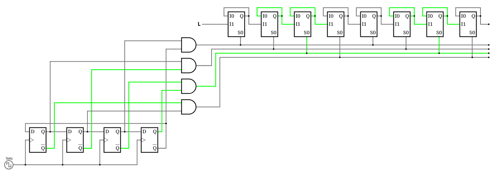
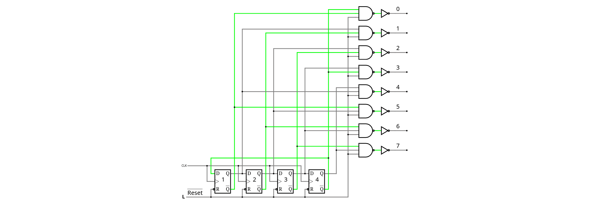
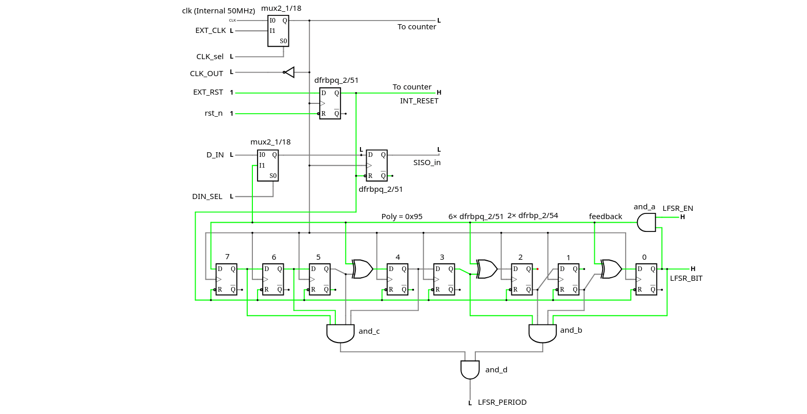

## How it works

As the name implies, it's a high density shift register for deep digital delays. This one aims at 512 bits of capacity.

According to the PDK for CMOS IHP at
https://github.com/IHP-GmbH/IHP-Open-PDK/blob/main/ihp-sg13g2/libs.ref/sg13g2_stdcell/doc/sg13g2_stdcell_typ_1p20V_25C.pdf

* Area of sg13g2_dfrbpq_1 : 48.98880
* Area of sg13g2_dlhq_1   : 30.84480
* Area of sg13g2_mux2_1   : 18.14400

MUX2 is almost 3× smaller than the DFF gate and could be used as a latch by feeding its output back to an input (if you know the old antifuse Actel FPGAs such as A1xxx, you know what I mean). This might not work well so I implement two versions:

* tt_um_ygdes_hdsiso8_mux2 with the MUX2 trick, for the best density,
* tt_um_ygdes_hdsiso8_dlhq with the typical transparent latch DLHQ, whose size is in-between.

This shift register uses 4 latches to store 3 bits at a given time and 4 non-overlapping "clock" pulses perform the shifting. Slowly. Just like below, but with 8 parallel chains.

The apparent complexity comes from the 8-phase clock, which is brought to the "asynchronous" domain. Each of the 8 lanes is 8× slower (which relaxes timing constraints) but the overall throughput is preserved by a demultiplexer and multiplexer. So it "should" work at "full speed", we'll see.

Compared to a shift register with normal DFF cells, it could store twice the same amount of bits per unit of surface, without the need of full-custom cells, as the controller's (sequencer, mux and demux) size becomes insignificant when the chain gets longer. Depths of several kilobits are possible without too much hassles (if the synth agrees), without a mad clock network, reducing simultaneous switching noise... Because since the pulses are slower, their traces are also shorter: each pulse affects only 1/8th of the cells at any time.

Ideally, manual placement of the 8 chains should be manual/tooled, not thrown at random. For implementation, I use a "tuned" Verilog workflow and instantiate cells directly from
https://github.com/IHP-GmbH/IHP-Open-PDK/blob/main/ihp-sg13g2/libs.ref/sg13g2_stdcell/verilog/sg13g2_stdcell.v . For simulation, parts of this file are copy-pasted to gate-specific files to remove some warnings (find them in /test).

## How to test

Good to know:
* Clock and Reset can be asserted by external pins and internal signals.
* The pin CLK_OUT copies the currently selected clock (negated), for external triggering and troubleshooting. If it oscillates, you're good.
* External reset pin EXT_RST (asserted at 0 like the internal one) overrides the internal reset, don't let it float. A weak pull-up to 1 is advised.
* External clock (pin EXT_CLK) can be selected when pin CLK_SEL=1 (don't let them float).
* Always assert EXT_RST (to 0) while changing the state of CLK_SEL.

Startup sequence:
* EXT_RST asserted (0)
* Choose CLK_SEL's value
* Run that clock
* Release EXT_RST (to 1, and RESET is internally clock-resynchronised so give it a couple of cycles to come into effect)
* Input a '1' or a '0' on D_IN, and observe the value appearing on D_OUT after about 512 clock cycles.

Extra insight and observability:
* When SHOW_LFSR=0, the IO port shows the 8 internal staggered pulses, turning from 0 to 1 and back to 0 in a linear sequence. It's just like a 4017 but 8 bits, since it's a Johnson counter too.
* 4 output pins provide the internal state of that 4-bit Johnson counter, or ring counter, thus you should observe a pretty pattern where only one pin changes at each clock cycle.

* You can measure the routing latency of the pins/pads/internal wires because CLK_OUT is inverted so just tie it to EXT_CLK with pin CLK_SEL=1. Probe with an oscillocsope and voilà, you have a free-running oscillator and you can directly measure the low and high times, each corresponding to one trip on the in or out wire.

## Bonus: LFSR

An 8-bit LFSR is integrated to ease testing. Thus an oscilloscope and a variable frequency oscillator are enough to characterise the achieveable speed. To use it,

* Assert the external reset EXT_RST (0)
* Select the desired clock (CLK_SEL)
* Unlock the internal LFSR by asserting pin LFRS_EN to 1
* Assert pin DIN_SEL (1) to internally route the LFSR bitstream to the SISO input
* Run the clock (internal or external, depending on CLK_SEL)
* Release EXT_RST (1) (now it should be started)
* Connect an oscilloscope to probe the signals D_OUT and LFSR_BIT while triggering on LFSR_PERIOD (which pulses every 255 clock cycles)
* See if both traces match (add some delay on LFSR_BIT if necessary).
* Send me pictures of your scope traces!

Note 1: 8 bits gives a period of 255, half of the SISO's depth, a small shift is expected and the SISO should store twice the whole cycle, but the output should align anyway.

Note 2: The LFSR_PERIOD pulse should appear 193 clock cycles after the release of the RESET pin.

Note 3: The RESET signal does not clear the contents of the SISO. Don't forget to flush its contents before use.

## External hardware

A basic custom test board will be put together, to hook the variable frequency generator and the oscilloscope probes.

Optionally, if you only want to make a "light chaser", hook 8 LED to the IO port, select the external clock and add a 555. Or you can have a more funky pattern by displaying the LFSR's state by setting SHOW_LFSR to 1.
